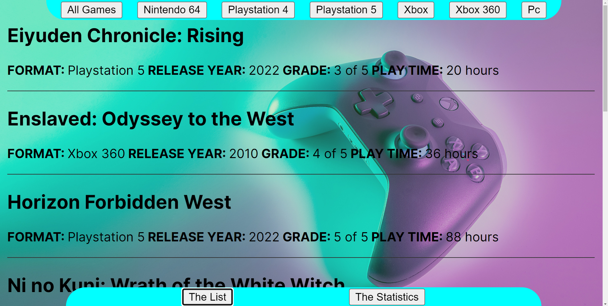
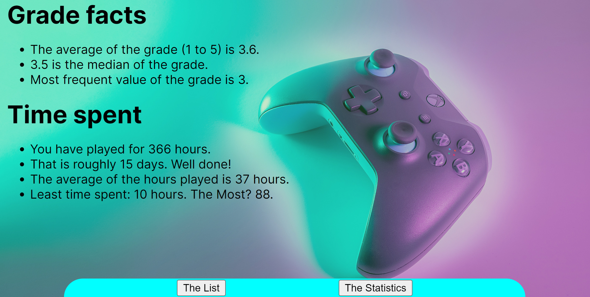

# My Favorite Games

A web application which demonstrates a video game collection and statistics concerning grades and play time.
This application is meant for an **end-user** with a video game collection. If you are a **developer** you should check out the GitHub repositorium with the [My Favorite Things](https://github.com/bamseponny/1dv610-mjukvarukvalitet-L1), with methods and a database which this application implements. If you are an **examinator** all of the above of course is of interest, and also the [testing](testrapport.md) and [reflections](reflektion.md) should be of great interest.

***

## Description

The idea with this application is to show off a collection of video games in a neat and tidy way, and also calculate some statistics regarding the spent hours and set grade. Via this app you can keep track on your collection and its statistics with minimal effort.

***

## Usage

The application has two primarily sections. 

One section is **the list** where you can see a complete collection of video games. By pressing one of the buttons in the top of the browser window you can also filter out different formats.

Another sections is **the statistics** where you can find fun facts regarding the grades and hours spent with the collection. For example you can find out the total number of days spent with collection and also the average grade.

***

## Technologies
The application is built via **HTML**, **CSS** and **JavaScript**, primarily by using **web components**. The later is a technique to build upon custom HTML elements, allowing for encapsulation and reusability. The app is also using a library, **My Favorite** Things, which is installed separately. You can find it via [GitHub](https://github.com/bamseponny/1dv610-mjukvarukvalitet-L1).

***

## Installation

1. Copy the repository via [GitHub](https://github.com/bamseponny/1dv610-mjukvarukvalitet-L2), `https://github.com/bamseponny/1dv610-mjukvarukvalitet-L1.git`
2. Open a terminal window in a folder where you want to clone the repositorium.
3. Input the command `git clone https://github.com/bamseponny/1dv610-mjukvarukvalitet-L1.git` to clone the project.
4. Open an integrated development environment (IDE) of your choice.
5. Run the commando `npm install` to install dependecies.
6. Run the commando `npm run dev` to try out the application in a local host.
7. To utilize the app to its fullest you should also install the My Favorite Things library. More information [here](https://github.com/bamseponny/1dv610-mjukvarukvalitet-L1).

***

## Contributing

Please reach out by opening an issue on Github if you would like to make any major changes to the applications's source code. You are also welcome to use the application's code in any way you find useful. However, it would be most precious for me personally to see how you utilize and build upon the application's source code.

***

## 1dv610-mjukvarukvalitet-L2

Assignment for the course 1DV610 at the Linnaeus University.

***

## License

[MIT](https://choosealicense.com/licenses/mit/)