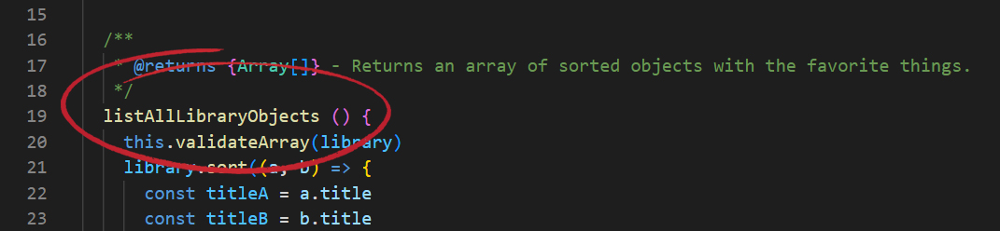
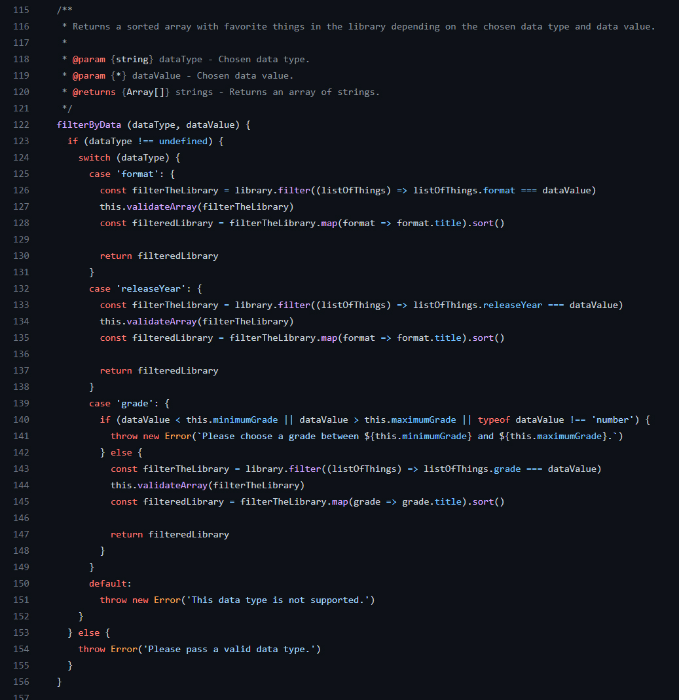
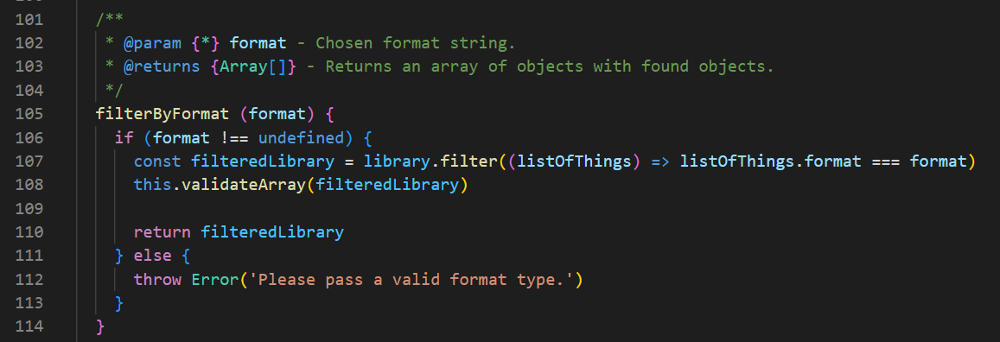
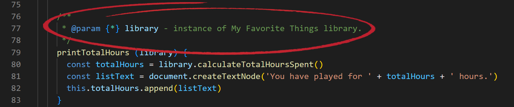
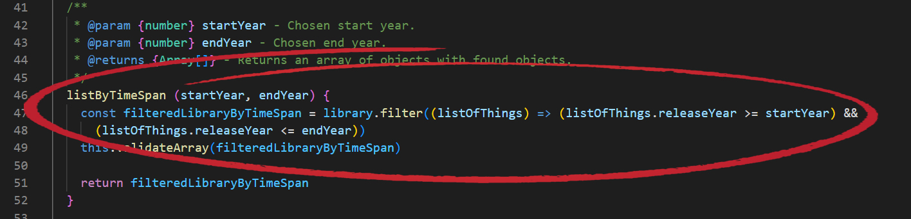
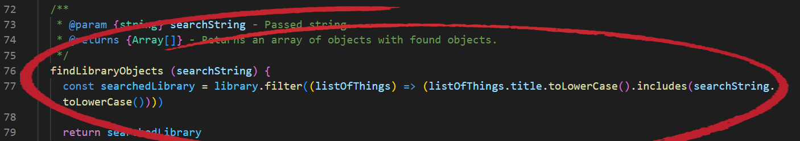

# Reflektion

## 2. Meaningful Names

Att något så enkelt kan vara så svårt. I teorin är det enkelt att säga: ett namn ska ska vara avslöjande, lätt att uttala och vara sökbart; alla regler från kapitel två av kurslitteraturen (C. Martin, Robert. 2009. Clean Code, 17-30). Att lyckas uppfylla *en* regel är i sig inte svårt. Metodnamnet **calculateAverage** (i L1) är lätt att uttala, men medelvärdet av *vad*? Häri ligger kapitels nyckel. Meningsfulla namn är inte *en* regel, utan flera stycken. Exemplet nedan (L1) hette till en början **listAllTitles**. Det var inte helt sanningsenligt, då metoden listar alla objekt i biblioteket. Därför: **listAllLibraryObjects**. Då uppfylls flera av Clean Codes krav, så som: namn som avslöjar intentionen (17-19), har namn som jag är lätt att uttala (21-22), är sökbart (22-23). Samtidigt får man göra personliga avvägningar. Ska jag vara *riktigt* noga borde namnet vara **listAllLibraryObjectsSorted**, men då börjar det bli svårt att läsa. Det är svårt att möta allt till 100 procent, och jag får kompromissa.

 

## 3. Functions

Det var nyttigt att i princip göra laboration 1 utan att reflektera över kodkvalitet, och därefter gå till boken. Ett tillvägagångssätt jag vill minnas att du, Daniel, föreslog. Att vi skulle *"göra först"* och *"tänka sedan"*. Det blev en hel del "aha"-upplevelser, inte minst efter bokens matiga kapitel 3 (Clean Code, 31-52). Enligt Clean Code ska metoder vara små (34-35), göra en sak (35-36) och Switch-satser (37-38) är absolut inte bra ("*Even a switch statement with only two cases is
larger than I’d like a single block or function to be.*"). I metoden jag lyfter (L1) bröt jag hårt mot exakt allt vad jag nämnt. I metoden skickade jag in två argument och filtrerade i biblioteket via en Switch-sats, som switchade till filtrering av betyg, releaseår och format. Den gjorde flera saker, var absolut inte liten, och var av Switch-karaktär. Så här blev det:

I refaktoreringen hade jag bokens ord färskt i minnet. Metoden delades i tre, som var och en gjorde en sak (i stället för tre). Switch-satsen var ett minne blott och metoderna är numer korta. Därmed blev de enklare att förstå och överskåda, då de faktiskt gör en sak. Här ser vi en av metoderna, som "på köpet" fick ett tydligare namn. Jag gillar att se hur bokens kapitel ger ringar på vattnet. När jag följde reglerna i kapitel 3 kom kapitel 2-nytta av bara farten.

 

## 4. Comments

Boken lyfter ett citat från Brian W. Kernighan and P. J. Plaugher: "*Don’t comment bad code—rewrite it.*" (Clean Code, 53). Väl sammanfattat. Under första året av utbildningen har jag bitvis känt mig låst vid kommentarerna. Det har känts "kladdigt" att kommentera minsta småmetod på ett sätt som i princip gör dem dubbelt så stora. Till vilken nytta? Boken ser kommentarer som just *"misslyckande"*. Behöver vi de har vi misslyckats (54). Jag tog fasta på detta men för att hålla ordning och reda beslöt jag mig för att ta bort "svepande" kommentarer, och bara hålla mig till parametrar och retursatser. Boken menar visserligen att de flesta kommentarer är *"dåliga kommentarer"* (59), men jag behövde hitta något slags mellanting. Det kändes naturligt. När jag ser tillbaka på det kan jag ändå känna att min mellantingsregel gjorde koden onödigt kladdigt. Mitt exempel (L2) hade inte behövt kommentar, ärligt talat. Att i stället döpa om parametern till *favoriteThingsInstance* hade varit nog så tydligt. Det hade sparat uttrymme – och kladd.

 

## 5. Formatting

Ordning och reda är återkommande för mig, och ger mig också ro. Det gäller i livet – och i koden. En del får jag gratis i kodandet då jag nyttjar Eslint, vilket gör att koden "säger ifrån" när jag avviker från standarden. Det gör det svårt att misslyckas. Boken tar dock upp ett par regler som däremot är enklare att misslyckas med. Vertical formatting (Clean Code, 76–85) handlar om hur stora klasser ska vara. De kan i princip vara hur stora eller små som helst; det viktiga är att klassen gör vad den utger sig för att göra. Min app (L2) är en relativt liten applikation uppstyckad i tre komponenter; en som omsluter (my-app-wrapper), en för listan med spel (my-game-list) och en för statistik (my-statistics). Man hade kunnat bryta ut ännu mer men komponenterna är relativt små, och hade jag exempelvis brutit ut olika typer av statistik är risken att det blivit oöverskådligt. Min modul (L1) är nära 400 kodrader, men där ligger också all funktionalitet för modulen. Enligt boken (77) är max 500 kodrader en bra tumregel. Boken tar också upp horizontal formatting (85–90), om hur *långa* kodrader ska vara. Något jag refakturerat i min L1:a, exempelvis i exemplet nedan. Ingen stor sak, men kodraden bli lite mer behaglig att läsa.

 

## 6. Objects and Data Structures

Kapitel 6 (Clean Code, 93–101) är bedrägligt kort, men jag har lite svårt att få huvudet kring det. En utmaning, kort sagt. I sektionen kring The Law of Demeter (97–100) tar boken upp kod som kan liknas vid tågkrasch. Jag kände mig träffad (om än inte av tågkraschen). Bokens exempel är `final String outputDir = ctxt.getOptions().getScratchDir().getAbsolutePath();`. Den bryter både mot regeln (en klass ska bara känna till sina metoder), men anses också vara ett slappt sätt överlag att skriva kod. Under min studietid har jag ofta återvänt till gammal kod och funderat på, rent ut sagt, vad tusan som pågår. Andra exempel än det nedan har varit värre då jag under L1 och L2 arbetat för att strukturera koden bättre. Här hade jag dock kunnat bryta ut det ytterligare lite till, så att koden kunde bli mer tydlig och strukturerad. 

 

## 7. Error Handling

Felhantering ska enligt Clean Code (103–112) inte dölja logiken. Den ska hanteras med "värdighet och stil" (103). I min L1:a kastar jag undantag. Då biblioteket bygger mycket på arrayer med objekt eller arrayer med siffror är det relativt enkelt att punktmarkera skeendena där det kan gå fel. I och med att jag har en klass och en metod i modulen som tar hand om felmeddelanden behöver jag inte heller "förstöra" koden med långa kodsjok som stör det metoderna faktiskt ska göra. Jag tycker mig ha funnit en bra balans mellan att ta höjd för fel men hantera dem på ett smidigt sätt. När jag hanterar betygsstatistik, i metoden `getGradeNumbers()` kollar jag omedelbart om arrayen uppfyller kraven, och slipper därmed göra det i metoder (exempelvis `calculateAverageGrade()`) som i sin tur kallar på 

 

//////// Gå igenom all kod inklusive kod från laboration 1 och uppdatera enligt bokens clean code kapitel 2-11 och det vi diskuterat på föreläsningar och workshops. Skriv en kort (4-6 meningar) reflektion för varje kapitel om hur just det kapitlet har påverkat eller inte påverkat din kod. Använd bokens termer. Ge exempel med läsbara screenshots från er kod till varje reflektion. Dokumentera detta till mig i ett separat dokument reflection.md där jag är mottagaren.

Fokusera på tydlighet, variation, ärlighet och vad som är intressant. Exempelvis om du har icke självklara överväganden med olika kvalitetsregler som står i konflikt med varandra så är dessa extra intressanta.

Jag kommer även titta på och bedöma er kod. Den skall därför i största mån vara skriven för att kunna fortsätta utvecklas av andra programmerare. 

C. Martin, Robert. 2009. Clean Code, 145-162.