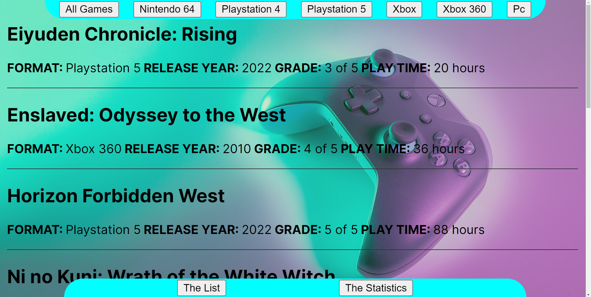
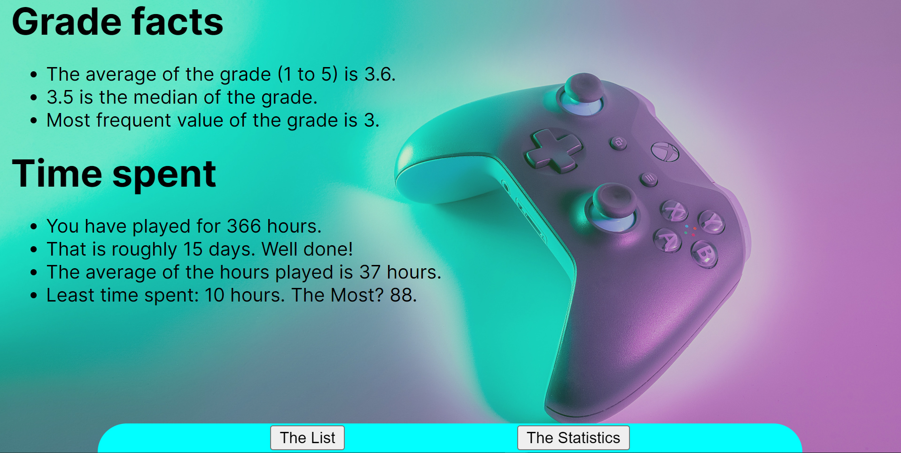
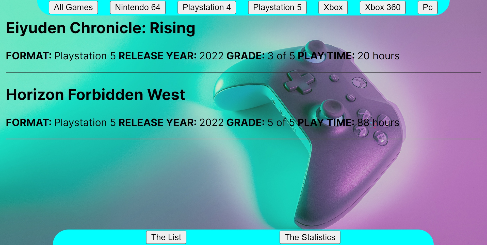
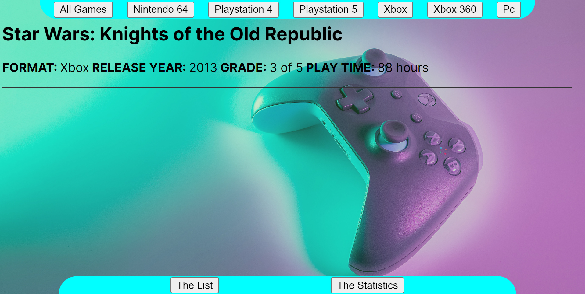
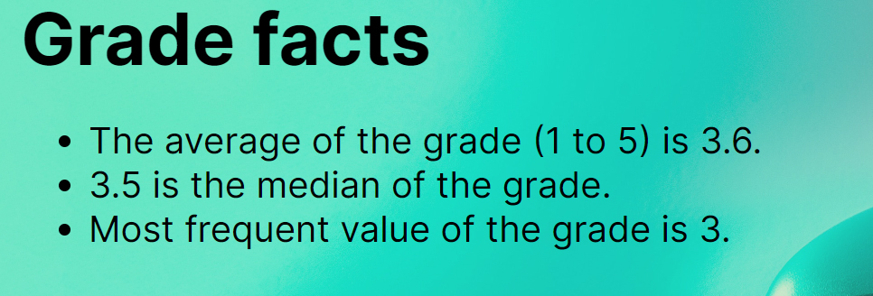
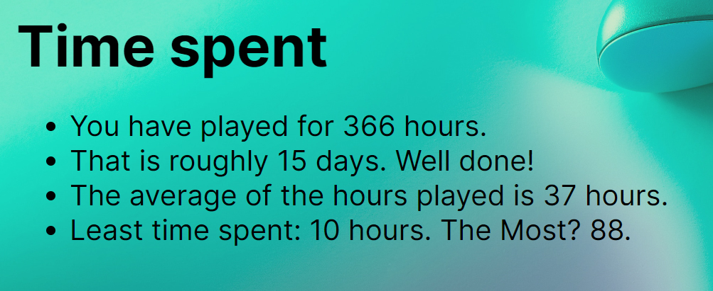

# Testrapport

### Hur jag testat

***

Jag har använt mig av manuell testning, och byggt vidare på det vi lärde oss i kursen 1DV613. Då skalan varit mindre har det inte blivit några iterationer, utan en enskild testtabell och beskrivning av de olika testerna.

### Testfall

***

Målet med min testning är att skapa överblick över testningen  och dokumentera de enskilda testerna. Samtliga tester sker mot version 1 av projektet.

### Testrapport

| User cases| Testmetod | Status|       
| --------- |:---------:|:-----:|
| UC 1    | Manuell   |✅ |
| UC 2    | Manuell   |✅ |
| UC 3    | Manuell   |✅ |
| UC 4    | Manuell   |✅ |
| UC 5    | Manuell   |✅ |

***

## Förberedelser
* Installera applikationen enligt instruktionerna i README:n.

***

## UC1 – Startsidan

**Beskrivning:** Kontrollerar att applikationen visar startsidan enligt förväntat utfall.

**Testinstruktion**
1. Starta applikationen via `npm run dev`.
2. Navigera via terminalens länk till önskad browser.

**Förväntat utfall:** 

***

## UC2 – Navigering

**Beskrivning:** Kontrollerar att applikationens navigation fungerar förväntat utfall.

**Testinstruktion**
1. Starta applikationen via `npm run dev`.
2. Navigera via terminalens länk till önskad browser.
3. Klicka på knappen *The List*. 
4. Klicka på knappen *The Statistiscs*.

**Förväntade utfall:** 

***

## UC3 – Listor

**Beskrivning:** Kontrollerar att applikationen visar de filtrerade spellistorna enligt förväntat utfall.

**Testinstruktion**
1. Starta applikationen via `npm run dev`.
2. Navigera via terminalens länk till önskad browser.
3. Klicka på knappen *The List*.
4. Klicka på knappen *Playstation 5*.
5. Klicka på knappen *Xbox*.

**Förväntade utfall:** 

***

## UC4 – Betygsstatistik

**Beskrivning:** Kontrollerar att applikationen visar betygsstatistiken enligt förväntat utfall.

**Testinstruktion**
1. Starta applikationen via `npm run dev`.
2. Navigera via terminalens länk till önskad browser.
3. Klicka på knappen *The Statistics*.

**Förväntat utfall:** 

***

## UC5 – Tidsstatistik

**Beskrivning:** Kontrollerar att applikationen visar tidsstatistiken enligt förväntat utfall.

**Testinstruktion**
1. Starta applikationen via `npm run dev`.
2. Navigera via terminalens länk till önskad browser.

**Förväntat utfall:** 

***

